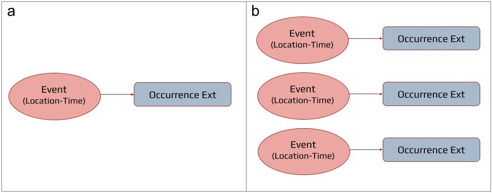
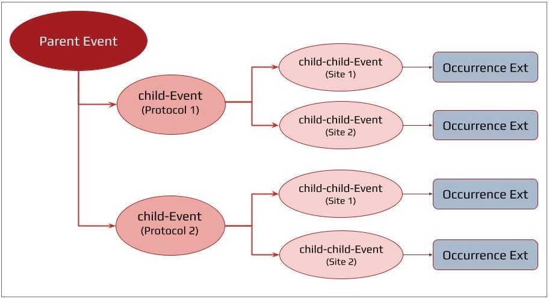
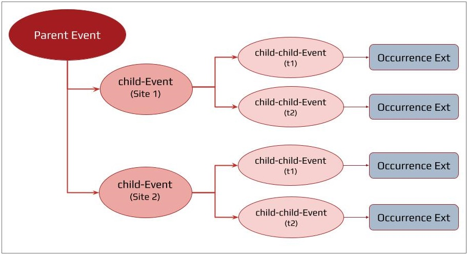

=== Survey sampling design and event hierarchy 

===== What is survey design and sampling event hierarchy?

Survey sampling design details the sampling strategy and how the survey event sites (e.g. stations, plots, transects) are laid out. The sampling event hierarchy is the translation of the survey sampling design into an event-based perspective using Darwin Core terms. 

===== Sampling event hierarchy terms

Historically, only two (2) terms were available to explicitly structure and relate different levels of sampling event hierarchy in a dataset: term:dwc[eventID] and term:dwc[parentEventID]. One additional Darwin Core event term, term:dwc[fieldNumber], provided a means by which to relate a sampling event with a dataset- or project-specific field number. The Humboldt extension provides an additional two terms—term:eco[siteCount] and term:eco[siteNestingDescription]—to better support complex or nested datasets (see below `NOTE: hyperlink to section number rather than using indexical text`). 

Review your DwC Event dataset to ensure that the survey design is accurately reflected in the use of the five (5) available sampling event hierarchy terms. Where additional events or event levels must be created, be sure to reference https://assets.ctfassets.net/uo17ejk9rkwj/8aIUAbLo0oycyMiM2IKUS/363edf7ab4558460cfe1ef140567450f/persistent_identifiers_guide_en_v1.pdf[A Beginner’s Guide to Persistent Identifiers^] for guidance in creating new persistent identifiers. 

IMPORTANT: Do NOT change existing identifiers if it can be avoided!

==== Non-nested datasets

[[fig-01]]
.A simple schematic of a non-nested event dataset structure (a) consisting of a single event with associated occurrences related to the event via the occurrence extension and (b) a series of individual events with associated occurrences related to the appropriate event via the occurrence extension.

*Non-nested datasets* may consist of a single sampling event with a single standardized sampling protocol that is not repeated (<<fig-01,Figure 1a>>) or a series of single sampling events that are not joined by a larger parent event (<<fig-01,Figure 1b>>). 

* Each event must have a unique term:dwc[eventID].
* Non-nested datasets will not have a term:dwc[parentEventID]. 
* term:eco[siteNestingDescription] does not need to be populated. 

==== Nested datasets

*Nested datasets* (multiple nested event levels) are established by relating a child event to a parent event through the child Event’s term:dwc[parentEventID]. The structure of these datasets can take various forms, but often center either first around the study site second and secondarily on protocol (<<fig-02,Figure 2>>) or conversely, focusing on protocol at higher hierarchical levels and secondarily on locality (<<fig-03,Figure 3>>). Alternatively, time-series dataset are temporally nested datasets (<<fig-04,Figure 4>>). 

* Each event must have a unique term:dwc[eventID], and each parent event must have its own term:dwc[parentEventID]. 
* Nested datasets should, at the parent event level, include the total number of sites sampled in term:eco[siteCount] and provide a textual description of the hierarchical sampling design using term:eco[siteNestingDescription]. 
* If the survey data include a field number for each specific event, this should be shared using term:dwc[fieldNumber].

[[fig-02]]
.Simplified example schematic of a nested event dataset structure representing a survey (Parent Event, dark red oval) with two survey sites (child-Events, medium red ovals) at each of which two protocols (child-child-Events, light red ovals) are implemented and occurrence information is collected and related to each sampling event using the occurrence extension.

[[fig-03]]
.Simplified example schematic of a nested event dataset structure representing a survey (Parent Event, dark red oval) with two protocols (child-Events, medium red ovals) which are each implemented at two survey sites (four independently surveyed child-child-Events, light red ovals) wherein occurrence information is collected in four (likely quantitative) occurrences lists and related to each sampling event using the occurrence extension.

[[fig-04]]
.Simplified example schematic of a nested event dataset structure representing a time series survey (Parent Event, dark red oval) with two survey sites (child-Events, medium red ovals) which are each independently sampled at two different times (four independently surveyed child-child-Events, light red ovals) wherein occurrence information is collected in four (likely quantitative) occurrences lists and related to each sampling event using the occurrence extension.

[[table-01]]
.Event hierarchy terms, their recommended usage (status), and example data entries
[cols="25,25,~"]
|===
|Status |Term |Example entry

|Required
|term:dwc[eventID]
|`survey2022_a-2`

|Required for nested datasets
|term:dwc[parentEventID]
|`survey2022`

.2+|Recommended
|term:eco[siteCount]
|`75`

|term:eco[siteNestingDescription]
|`25 survey sites each with 3 1m2 quadrats`

|Share if available
|term:dwc[fieldNumber]
|`RV Sol 87-03-08`

|===
