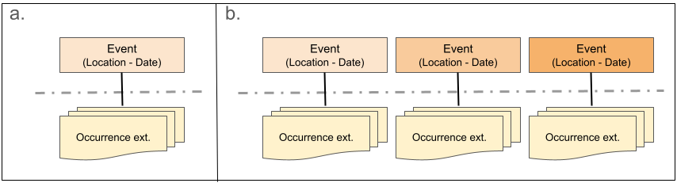
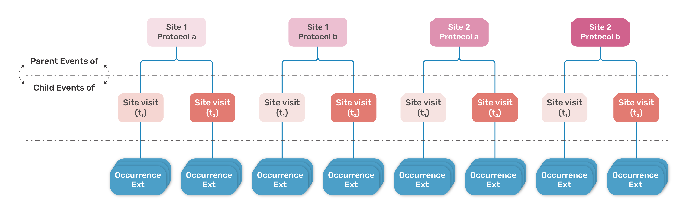
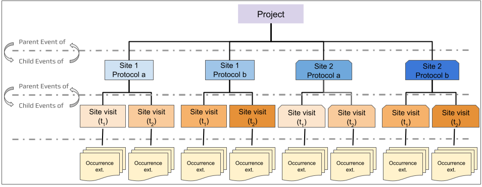
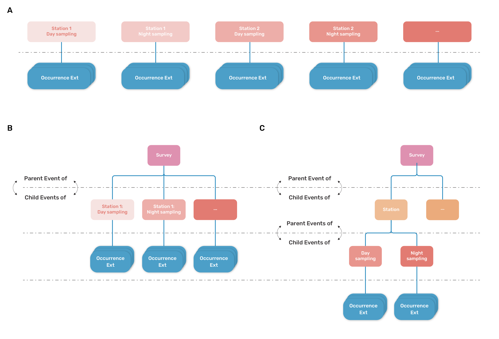

=== Survey sampling design and event hierarchy 

==== What is survey design and sampling event hierarchy?

The first step in the process of updating your Darwinc Core dataset it check that the existing datase structure reflects the survey design implemented to capture the data reported in your dataset. *Biological survey design*, details the sampling strategy and how the survey event sites (e.g. stations, plots, transects) are laid out. The *sampling event hierarchy* is the translation of the survey sampling design into an event-based perspective using Darwin Core terms. The goal in establishing the dataset structure is to keep it as simple as possible while representing the survey design as accurately as possible.

==== Non-nested datasets

The simplest Event data structure is a non-nested dataset. *Non-nested datasets* reflect a simple or flat survey design structure (<<fig1, Figure 1>>). These are typically simple datasets consisting of:

* a single sampling event occurring at a particular place and time and conducted using a single standardized sampling protocol that is not repeated and is not necessarily part of a spatially larger sampling schema (Figure 1a), or +
* a series of single sampling events that are not joined by a larger parent Event (Figure 1b). A compilation dataset (combination of unrelated surveys, compiled data sources and/or literature searches, see Biological survey data section) could be a special case of non-nested dataset where there is a unique Event level that describes the compilation itself (e.g., the broad area where multiple surveys are aggregated), which results in several occurrences.

[[fig1]]
.A simple schematic of a non-nested Event dataset (a) consisting of a single Event with associated Occurrences related to the Event via the Occurrence extension or (b) a series of individual Events with associated Occurrences related to the appropriate Event via the Occurrence extension. 

==== Nested datasets

More complex survey designs will require implemntation of a nested dataset structure. *Nested datasets* use parent-child relationships to capture information collected through more complex survey design, such as datasets resulting from repeated sampling events and/or multiple sampling protocols. Creating nested Event levels may be important to relating the full story a dataset has to tell and to facilitating downstream analysis of the data. 

*There is no single correct dataset structure,* and identifying the data structure most appropriate for a dataset may not always be a straightforward process. However, structure is most commonly defined as a function of sampling location, protocol, and date. 

****
[discrete]
==== In a nested dataset
* All Events *_except those at the lowest Event level_* are considered the *parent Event* to any Event(s) beneath it. These *child Events* may represent either multiple sampling sites, protocols, or repeated sampling at the same locality using the same protocol. The top-most Event level does not have a parent Event. +
* *_A parent Event MUST encompass its child Events spatially and temporally._* Specifically, the spatial extent and temporal interval of a parent Event MUST contain the spatial extents and temporal intervals of all of its children (see Section 3.2.1 Principle of spatiotemporal coverage  in https://eco.tdwg.org/hierarchy/#321-principle-of-spatiotemporal-coverage[Properties of hierarchical events in the Humboldt Extension for Ecological Inventories^]).
* *_Each Event level should reflect a meaningful ecological or operational unit (e.g., spatial, temporal, or ecological scale) in the survey design._* An Event level should be added if the addition of that Event level will facilitate data interpretation, downstream analysis, and/or linkage of information across datasets/data sources. *Do not create Event levels that are not necessary.* +
* Higher Event levels should include information that applies to all subsequent and lower Events. +
* Child-most Event level represents an Event that implements a single, reported sampling protocol at a single site  at a particular interval of time.

Refer to https://eco.tdwg.org/hierarchy/[Properties of hierarchical events in the Humboldt Extension for Ecological Inventories^] (TDWG Humboldt Extension Task Group, 2024) for more information about creating nested data structures for Darwin Core datasets.
****

Consider a survey that implements two sampling protocols at two sites with multiple site visits for each unique site-protocol combination. This dataset could be structured with two Event levels as shown in <<fig2, Figure 2>>. Here, the highest event level will have four events representing each unique site-protocol combination: Site 1–Protocol a, Site 1–Protocol b, Site 2–Protocol a, Site 2–Protocol b. Events at the lowest event level will  be site visits that occur on a particular date for each site-protocol combination. Organismal Occurrence information collected during a site visit will be linked to the relevant site visit. This two Event level structure represents the simplest possible nested dataset structure, with only a single level of nesting.

It is ideal to structure a dataset such that each implemented protocol and unique site location should be established as a specific Event such that it is clear what protocol was implemented where to capture the Occurrence or other information connected to the lowest Event level. However, it is not always possible to disentangle information collected using multiple protocols.

[[fig2]]
[caption="Figure 2. "]
.Simplified example schematic of a nested Event dataset consisting of a series of surveys conducted at two sites (Site 1 and Site 2) with two distinct sampling protocols (Protocol a, Protocol b) represented by the blue boxes. Each protocol is implemented at each site on two different dates (Site visit t1, Site visit t2) with associated Occurrences related to the appropriate Event via the Occurrence extension (yellow boxes). 

==== Project information

Datasets that are collected as part of a larger or established network or project should report as much contextual information as possible to capture information about the project or network or specifically stated survey scope(s). Project-level information will always be shared at the highest event level. This can be achieved in one of two ways:

* By embedding project-level information within the highest existing survey Event level. With the dataset presented in <<fig2, Figure 2>>,  project-level information would be included with each of the four Site–Protocol Events. +
* By introducing a new parent Event level above all existing Events, dedicated to capturing project-level context. In the context of the example dataset presented in <<fig2, Figure 2>>, this would mean adding a third Event level to the dataset structure that is parent to the Site–Protocol event level. The structure with this additional top-level Event is illustrated in <<fig3, Figure 3>>. 

[[fig3]]
[caption="Figure 3. "]
.Simplest nested hierarchy with an additional event level to consolidate all survey Events under the context of a project (purple box).

==== Complex survey design

Although the recommendation is to keep dataset structure as simple as possible, more complex nesting may be necessary to accurately represent survey design and support data reuse. Added complexity can improve clarity when:

* multiple protocols are implemented within the same survey framework, +
* survey outputs include a mix of data types (e.g., specimen collections, field observations, observed relationships), +
* collected material contributes to downstream products (e.g., lab measurements, voucher specimens, media representations), or +
* relationships among datasets need to be preserved or exposed.

Consider the dataset https://obis.org/dataset/96844ba5-08c1-4299-b778-0db31986b669[Krill along the 110°E meridian: Oceanographic influences on assemblages in the eastern Indian Ocean, RV Investigator voyage IN2019_V03 (2019)^], published by OBIS-Australia. The dataset contains information about a zooplankton survey conducted by the https://ror.org/01mae9353[CSIRO Marine National Facility^] in the eastern Indian Ocean in 2019. The survey consisted of daytime and nighttime sampling at 20 locations (stations) along an established transect. This dataset could be structured as a non-nested dataset or as nested dataset; and, as a nested dataset, the structure could be simple or more complex or more deeply nested with more than two Event levels.  

* *Non-nested dataset structure* (Figure 4a): As a non-nested dataset each sampling at a particular station at a particular date and time would be a unique Event  with no obvious link to other Events in the dataset beyond being part of the same dataset. Implementing this structure is the simplest approach to sharing data from the survey, however, without any nesting of Events, it may be difficult for data users to understand the relationships between survey Events. +
* *Simple nested dataset structure* (Figure 4b): As a simple nested dataset, the data structure would consist of two Event levels with the highest Event level capturing information about the overall cruise or campaign (gray box) and second Event level represents the daytime and nighttime sampling events at each station as a series of unique Events (orange boxes). +
* *Deeply nested dataset structure* (Figure 4c): As a more deeply nested dataset, the structure would consist of three Event levels such that the highest Event level represents the Survey (that is, the overall cruise or campaign; gray box), the middle Event level represents each of the 20 survey stations (blue boxes), and the lowest Event level represents the daytime and nighttime sampling events at each station (orange boxes. Note that the child Events of each parent Event are used to report independent replicates of the same type within the same parent Event and/or to preserve individual sampling units. 

If the survey was a unique event, this simpler two Event level structure would likely suffice. However, the stations sampled during the survey are standard sampling locations used in other survey efforts. To make it easier to link information from this dataset to others conducted at the same localities, a more complex nested structure was deemed appropriate. 

[[fig4]]
[caption="Figure 4. "]
.Three potential simple schematics for a zooplankton survey conducted at 20 stations, each sampled once during the day and once at night: non-nested (a), simple nested (b), and complex or deeply nested (c).

==== Sampling Event hierarchy terms

Historically, only two (2) terms were available to explicitly structure and relate different levels of sampling event hierarchy in a dataset: term:dwc[dwc:eventID] and term:dwc[dwc:parentEventID]. One additional Darwin Core event term, term:dwc[dwc:fieldNumber], provided a means by which to relate a sampling event with a dataset- or project-specific field number. The Humboldt extension provides an additional two (2) terms—term:eco[eco:siteCount] and term:eco[eco:siteNestingDescription]—to better support complex or nested datasets. 

*Non-nested datasets*

* Each Event in a non-nested dataset must be assigned a unique term:dwc[dwc:eventID]. +
* Non-nested datasets will not have a term:dwc[dwc:parentEventID]. 

*Nested datasets*

Nested hierarchies are established by relating a child Event to a parent Event through the child Event´s term:dwc[dwc:parentEventID]. As such, these more complex datasets require use of both term:dwc[dwc:eventID] and term:dwc[dwc:parentEventID].

* Each Event in a nested dataset must have a unique term:dwc[dwc:eventID]. +
* Each child Event should include the term:dwc[dwc:parentEventID] of its parent in term:dwc[dwc:parentEventID].

In addition to Event and parent Event identifiers:

* *Site count and site nesting description:* Nested datasets should, at the parent Event level, include the total number of sites sampled in term:eco[eco:siteCount] and provide a textual description of the survey design or site sampling structure using term:eco[eco:siteNestingDescription]. +
* *Field number:* If the survey data include a field number for each specific Event, this should be shared using term:dwc[dwc:fieldNumber].

[caption=]
.Event hierarchy terms, their recommended usage (status), and example data entries.
[width="100%",cols="34%,33%,33%",options="header",]
|===
|Status |Term |Example entry
|Required
|term:dwc[dwc:eventID]
|`survey2022_a-2`

|Required for nested datasets
|term:dwc[dwc:parentEventID]
|`survey2022`

.2+|Recommended
|term:eco[eco:siteCount]
|`75`

|term:eco[eco:siteNestingDescription]
|`25 survey sites each with 3 1m2 quadrats`

|Share if available
|term:dwc[dwc:fieldNumber] 
|`RV Sol 87-03-08`
|===

Review your DwC Event dataset to ensure that the survey design is accurately reflected in the use of the five (5) available sampling event hierarchy terms. Where additional events or event levels must be created, be sure to reference https://assets.ctfassets.net/uo17ejk9rkwj/8aIUAbLo0oycyMiM2IKUS/363edf7ab4558460cfe1ef140567450f/persistent_identifiers_guide_en_v1.pdf[A Beginner’s Guide to Persistent Identifiers^] for guidance in creating new persistent identifiers. 

IMPORTANT: Do NOT change existing identifiers if it can be avoided!

<<<
