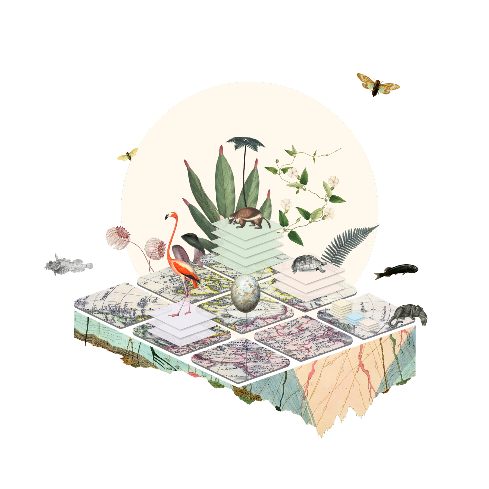

// add cover image to img directory and update filename below
ifdef::backend-html5[]

endif::backend-html5[]

== Colophon

=== Suggested citation

Ingenloff K (2025) Survey and monitoring data quick start: A guide to updating a Darwin Core Event dataset with the Humboldt extension. GBIF Secretariat: Copenhagen. https://doi.org/10.35035/doc-7t3p-ve38

=== Authors

https://orcid.org/0000-0001-5942-9053[Kate Ingenloff^]

=== Contributors

https://orcid.org/0000-0002-9216-2917[Cecilie Svenningsen^]
https://orcid.org/0000-0002-1789-1183[Javier Gamboa^]
https://orcid.org/0000-0002-1720-0127[Yanina V. Sica^]
https://orcid.org/0000-0001-7087-2646[Yi Ming Gan^]
https://orcid.org/0000-0002-0500-0339[Zachary R. Kachian^]
https://orcid.org/0000-0001-9730-8340[Peter Brenton^]
https://orcid.org/0000-0002-0595-7827[Wesley M. Hochachka^]
https://orcid.org/0000-0003-1144-0290[John Wieczorek^]
https://orcid.org/0000-0003-1617-5895[Robert D. Stevenson^]
https://orcid.org/0000-0003-2475-132X[Anahita J.N. Kazem^]
https://orcid.org/0000-0002-2919-1168[Dmitry Schigel^]
https://orcid.org/0000-0003-4365-3135[Steven J. Baskauf^]
https://orcid.org/0000-0002-6056-5084[Paula Zermoglio^]

=== Licence

The document _Survey and monitoring data quick start: A guide to updating a Darwin Core Event dataset with the Humboldt extension_ is licensed under https://creativecommons.org/licenses/by-sa/4.0[Creative Commons Attribution-ShareAlike 4.0 Unported License].

=== Acknowledgement

_Survey and monitoring data quick start: A guide to updating a DwC Event dataset with the Humboldt extension_ was produced under https://biodt.eu[the BioDT project^], which received funding from the European Union’s Horizon Europe research and innovation programme under https://doi.org/10.3030/101057437[grant agreement No 101057437^].

=== Persistent URI

https://doi.org/10.35035/doc-7t3p-ve38

=== Document control

v0.1, January 2025

=== Cover image

Illustration by Javier Gamboa, GBIF Secretariat 2025. Licensed under https://creativecommons.org/licenses/by-sa/4.0[Creative Commons Attribution-ShareAlike 4.0 Unported License].
