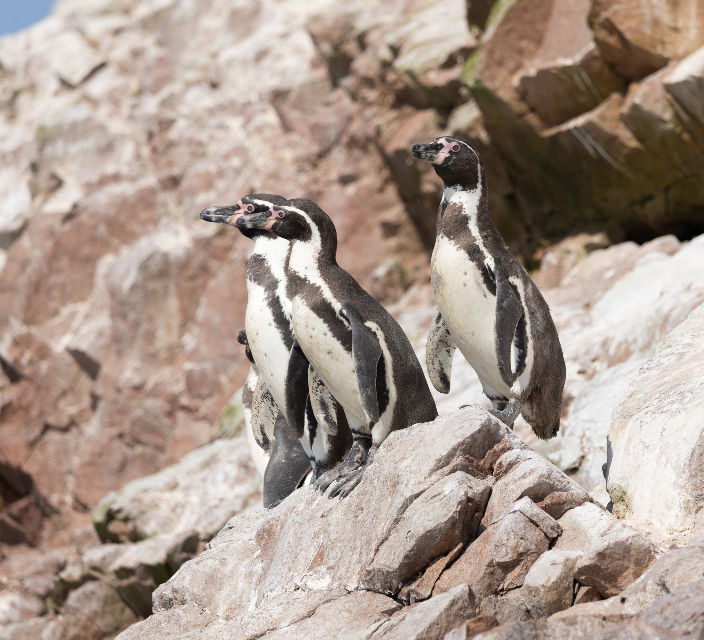

// add cover image to img directory and update filename below
ifdef::backend-html5[]

endif::backend-html5[]

== Colophon

=== Suggested citation

Ingenloff K (2025) Survey and monitoring data quick start: A guide to updating a Darwin Core Event dataset with the Humboldt extension. GBIF Secretariat: Copenhagen. https://doi.org/10.35035/doc-7t3p-ve38

=== Authors

https://orcid.org/0000-0001-5942-9053[Kate Ingenloff^]

=== Contributors

https://orcid.org/0000-0002-9216-2917[Cecilie Svenningsen^]

=== Licence

The document _Survey and monitoring data quick start: A guide to updating a Darwin Core Event dataset with the Humboldt extension_ is licensed under https://creativecommons.org/licenses/by-sa/4.0[Creative Commons Attribution-ShareAlike 4.0 Unported License].

=== Acknowledgement

_Survey and monitoring data quick start: A guide to updating a DwC Event dataset with the Humboldt extension_ was produced under https://biodt.eu[the BioDT project^], which received funding from the European Union’s Horizon Europe research and innovation programme under https://doi.org/10.3030/101057437[grant agreement No 101057437^].

=== Persistent URI

https://doi.org/10.35035/doc-7t3p-ve38

=== Document control

v0.1, January 2025

=== Cover image

Humboldt penguin (_Spheniscus humboldti_), observed in Peru. Photo 2024 Álvaro Alemany via https://www.gbif.org/occurrence/4909055715[iNaturalist Research-grade Observations^], licensed under http://creativecommons.org/licenses/by-nc-sa/4.0/[CC BY-NC-SA 4.0^].
